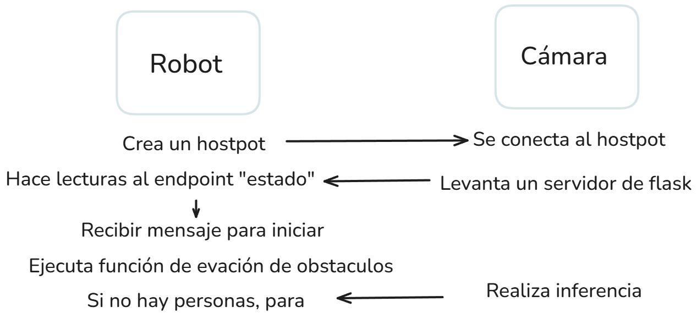

# Presentación de SpiderPI

El repositorio está dividido en dos carpetas:

- `camara`: contiene el servidor de detección de personas 
- `robot`: contiene el cliente de robot

Para ejecutar el servidor de detección de personas o el cliente de robot, puede ejecutar los siguientes comandos:

```bash
python camara/deteccion_server.py
python robot/robot_client.py
```
El server publica el estado de presencia de personas en la sala con el endpoint de "estado". Este, solo pasará a falso cuando hayan pasado 10 segundos sin haber detectado una persona.
El cliente se encarga de hacer lecturas al servidor cada de segundos, para saber si debe de detener el proceso.

Por ahora, si se detecta una persona, el cliente hace un print. Hay que integrarlo con el avoidance

Esta comunicación se representa en la siguiente imagen:

